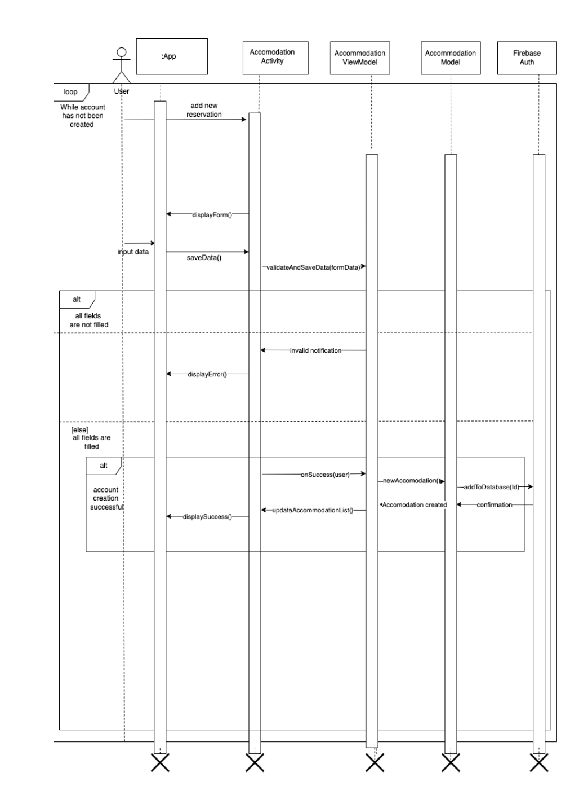
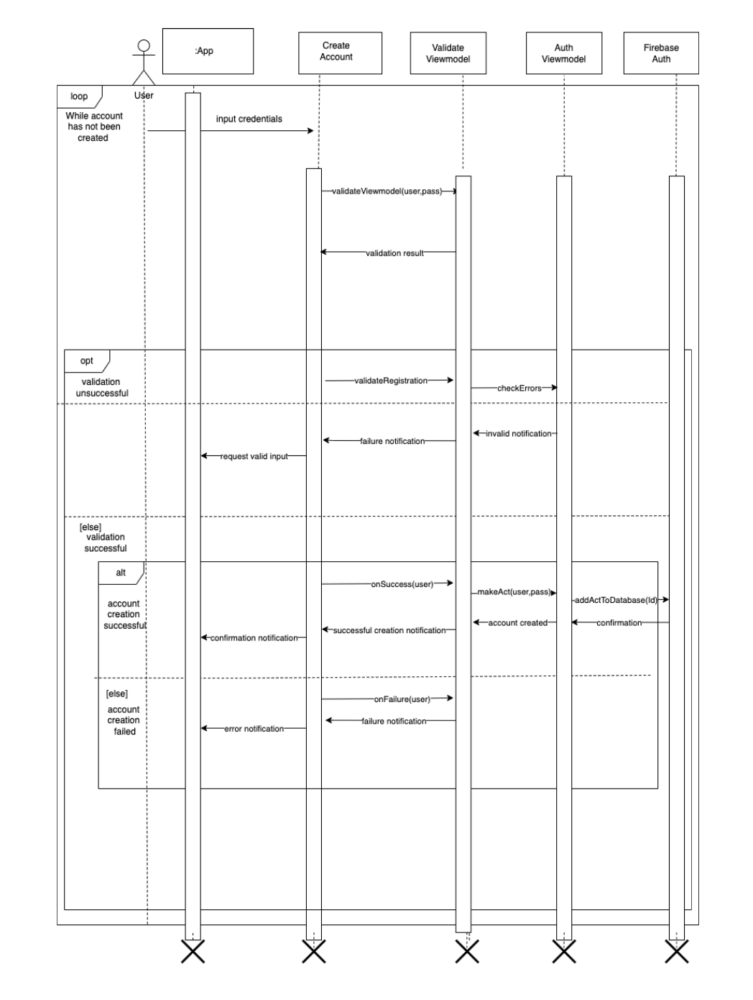
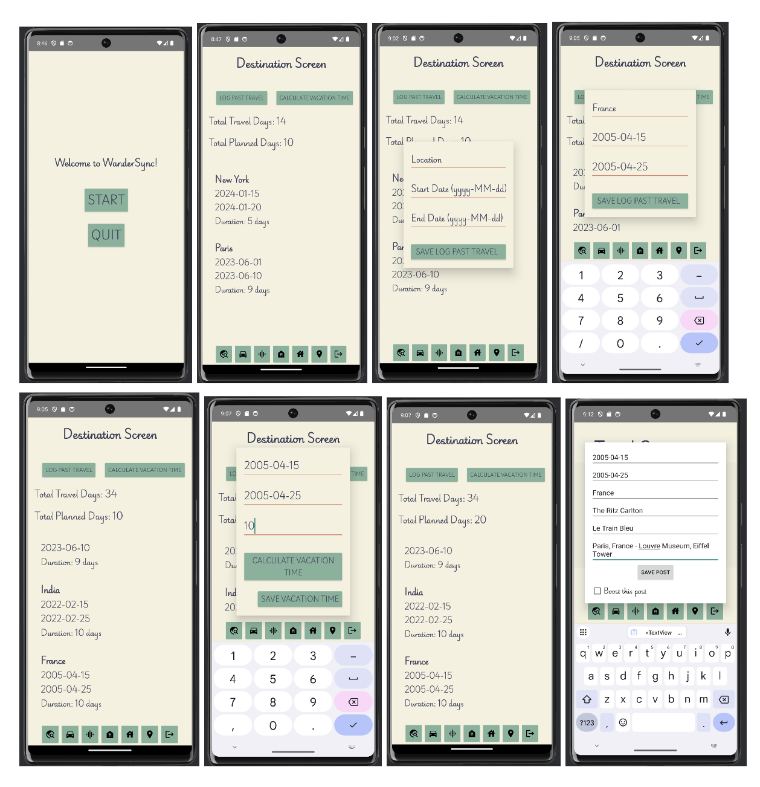
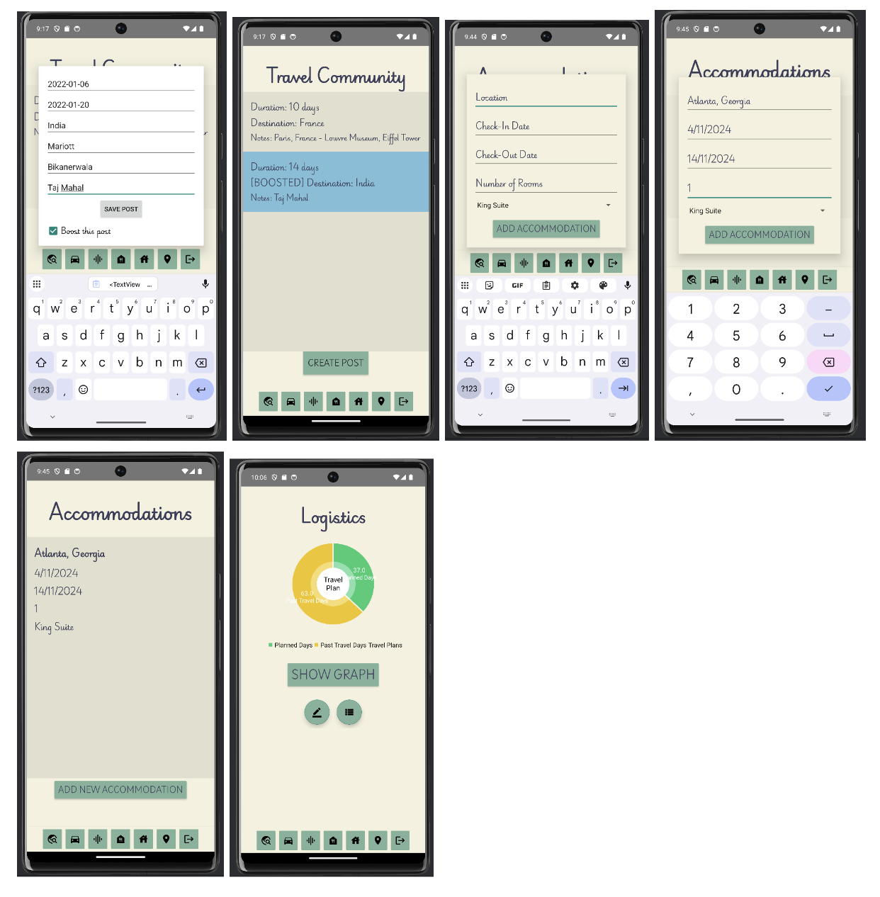

# 🎒🌍 CS2340 Group 29: WanderSync!

## Introduction

**Welcome to WanderSync: A Collaborative Travel Management System!** ✈️🗺️

WanderSync is designed to **simplify** and **enhance** the process of creating and managing travel itineraries for both **solo travelers** and **groups**. Our goal is to provide an **intuitive** and **comprehensive** platform that allows users to plan, organize, and synchronize all aspects of their travel experiences **seamlessly**.

With a strong focus on **user-friendly functionality** and **real-time collaboration**, WanderSync empowers users to contribute to travel plans effortlessly. The app integrates essential travel details such as **destinations**, **transportation options**, **accommodations**, **dining reservations**, and **personal notes** into one cohesive interface. Users can share updates, create shared travel agendas, and synchronize changes with group members in **real time**. 🔄

**Key Features of WanderSync include:**

- 🔒 **Secure user authentication** to ensure data privacy.
- 📅 **Efficient itinerary management tools** for organizing destinations and travel dates.
- 👥 **Collaborative planning capabilities** that allow users to invite others to participate in trip modifications.
- 📊 **Data visualization tools** to help users compare planned versus allocated vacation days.
- 🌐 A **travel community feature** where users can share and explore itineraries for inspiration.

The project is being developed in **four sprints**, with each phase focusing on expanding and refining its functionality. From establishing foundational features to integrating advanced tools like a travel community database, WanderSync is a **comprehensive solution designed for modern travelers** who want to streamline and enhance their travel planning process.

---

## Design & Architecture 🛠️

Below are two use case diagrams illustrating some of the many use cases and functionalities WanderSync offers:

The architecture of WanderSync is **modular** and **scalable**, emphasizing **separation of concerns** and **maintainability**. Our app revolves around a **Model-View-ViewModel (MVVM) pattern**, where activities and fragments serve as the **UI (View)** components, interacting with the **ViewModel** to manage the UI-related data.

The data layer is handled by **Firebase**, which stores user and destination data, with **Firebase Realtime Database** being used to store user-specific travel information like destinations, dates, and other trip-related details. The app also follows best practices for handling asynchronous operations with listeners (e.g., `ValueEventListener`), ensuring smooth data synchronization with Firebase, and minimizing memory issues, as demonstrated by our focus on using `addListenerForSingleValueEvent`.

This architecture facilitates a **clean**, **efficient**, and **responsive** design that aligns with software engineering principles such as **modularity**, **scalability**, and **maintainability**.

---

## User Interface (UI) 🎨

Take a sneak peek at our user-friendly interface:

---

## Functionality 🚀

Check out our **Video Demonstration** to see WanderSync in action! 🎥

*Click the link above to watch the video.*

---

## Conclusions & Learnings 📚

The development of WanderSync has been a **rewarding journey** of growth and learning for our team. One of the most significant challenges we faced was designing an **authentication system** that seamlessly integrates user invitations and **role-based access**. Understanding the intricate dynamics of **secure user management** and implementing a feature where invited users can accept invitations to join a planning page was both challenging and educational.

The project's real-world application of **Firebase** for authentication and data management reinforced the importance of **scalable** and **secure backend systems**. We also gained deeper insights into **user experience design**, ensuring the invitation and acceptance processes are intuitive for all users.

### Team Contributions 🤝

- **Vrinda** and **Aditi** and **Tanya**: Implementation of the **logistics screen**, vital for features like the visualization of travel days and inviting users to collaborate.
- **Vrinda**: Development of the **accommodation screen**, adding seamless management of lodging reservations, ensuring a clear and organized interface.
- **Afsheen**: Creation of the **dining screen**, providing users with a smooth reservation experience.
- **Sid** and **Nedu**: Delivery of a functional **travel community screen** and providing technical support across other screens.

This project honed our **problem-solving skills**, especially when dealing with complex relationships between users, permissions, and access control. It has also been a testament to the value of **collaborative planning**, as designing features like shared trip modifications required a **user-centric mindset** and attention to detail.

This project has deepened our understanding of **Android Studio development** and **backend integration**, and enhanced our ability to design systems that facilitate **collaboration**, an invaluable skill for future endeavors.

---

